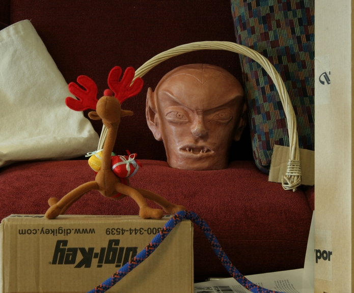
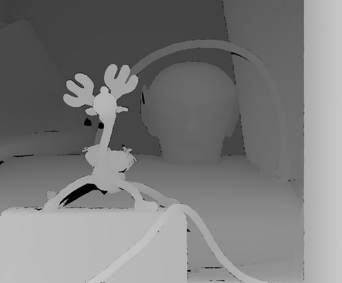

# 3DSSF-Stereo-Matching

Implemented a Naive and a Dynamic Programming stereo matching scheme.

**Input examples**

 
 

**Ground truth**

 
 

**Naive disparities**
 
 

**Dynamic Programming disparities**
 
 

