# 3DSSF-Stereo-Matching

Implemented a Naive and a Dynamic Programming stereo matching scheme.

**Input examples**

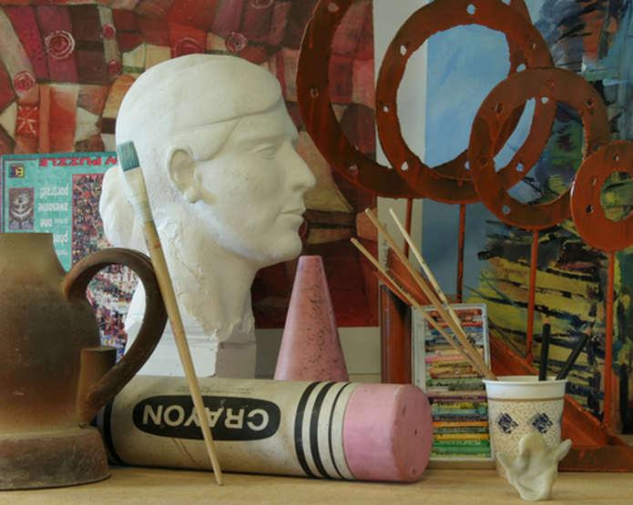 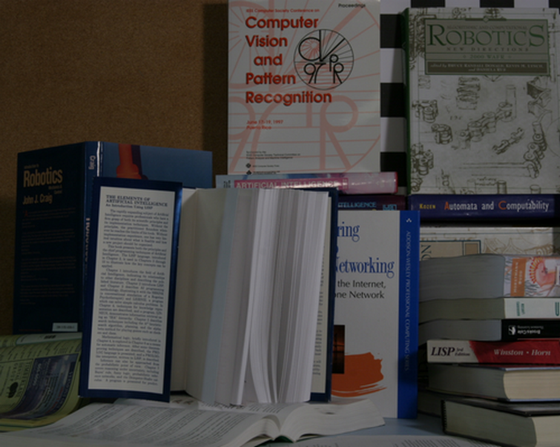
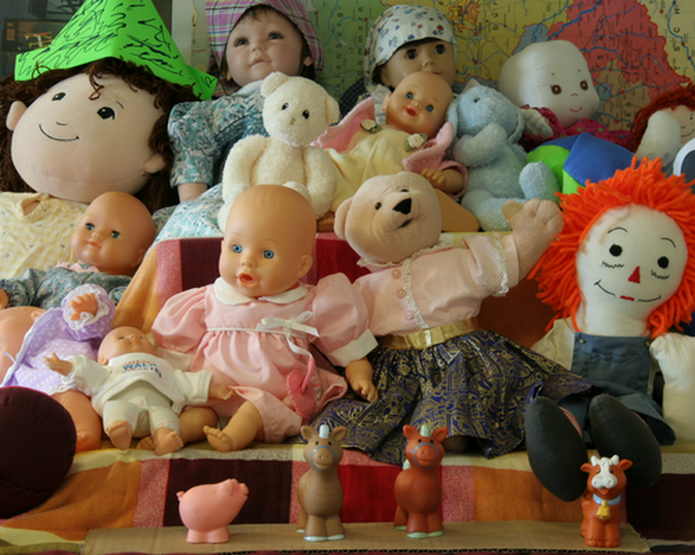 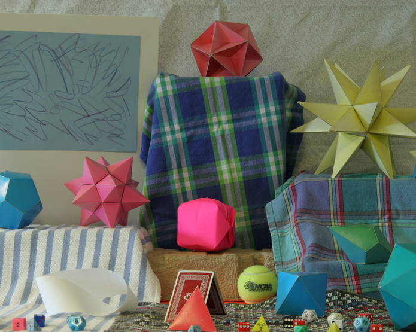

**Ground truth**

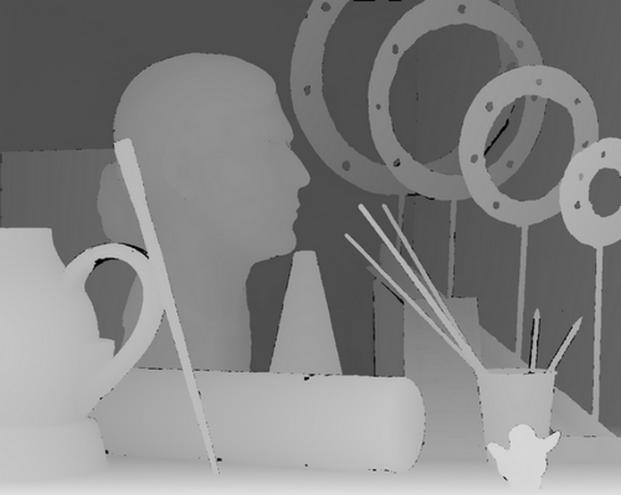 
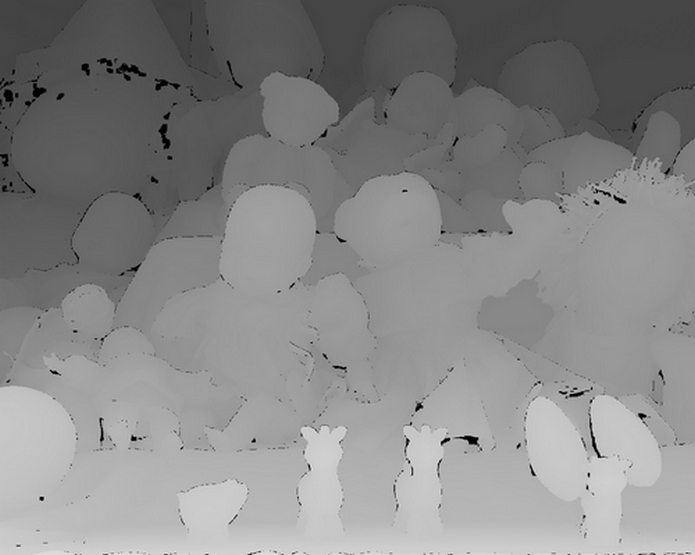 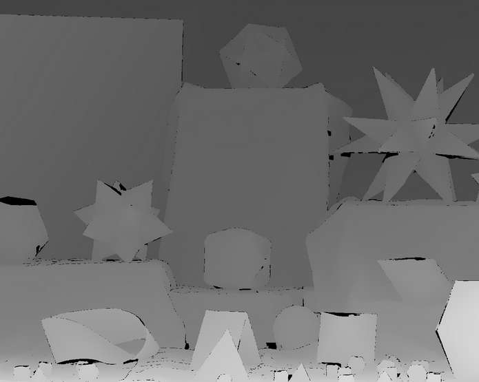

**Naive disparities**

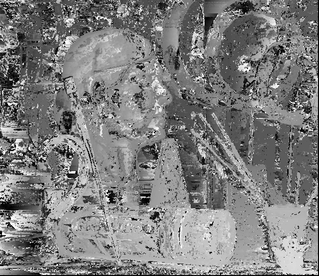 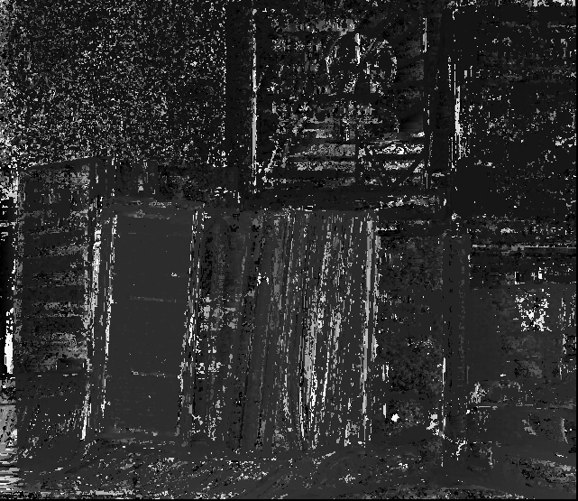
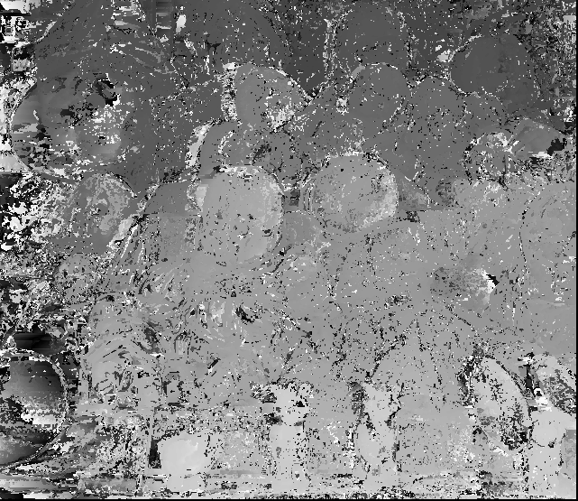 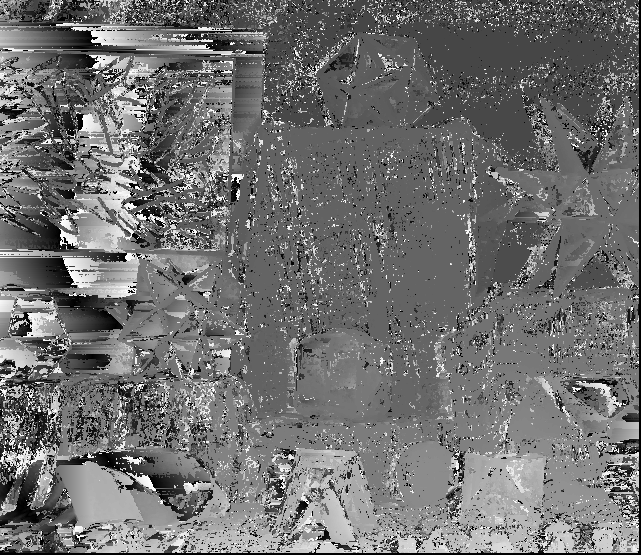

**Dynamic Programming disparities**

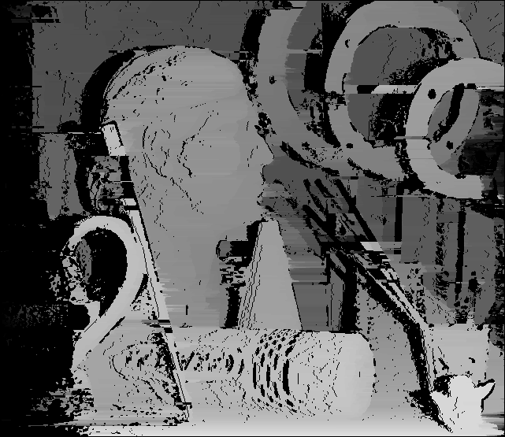 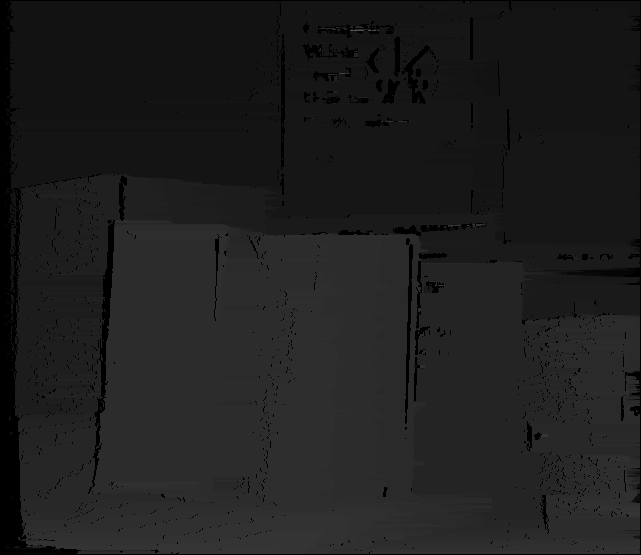
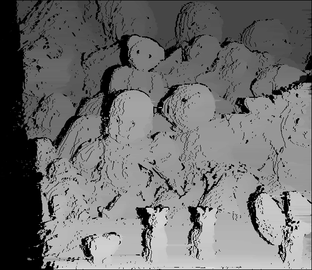 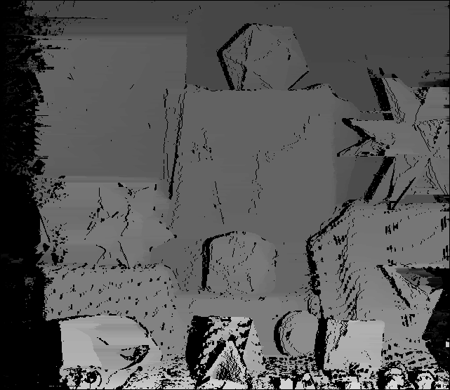

**Point clouds**

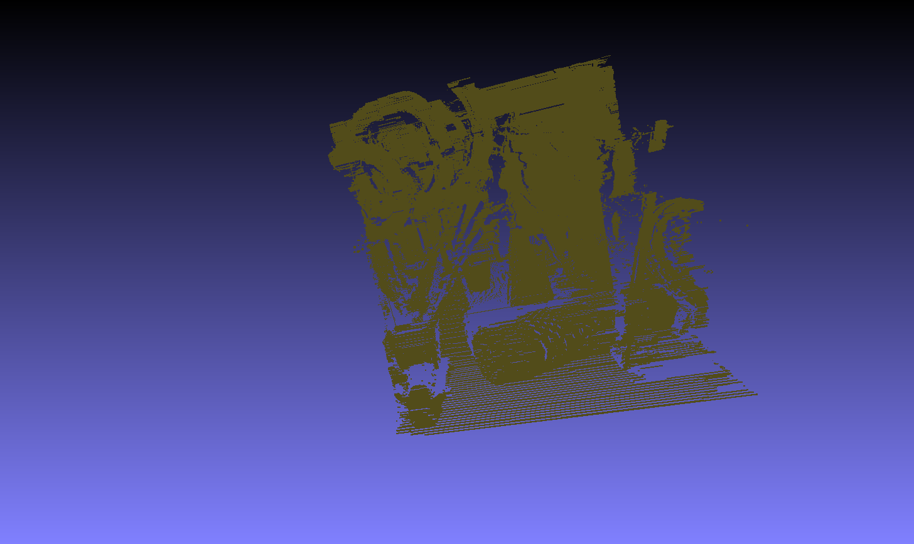 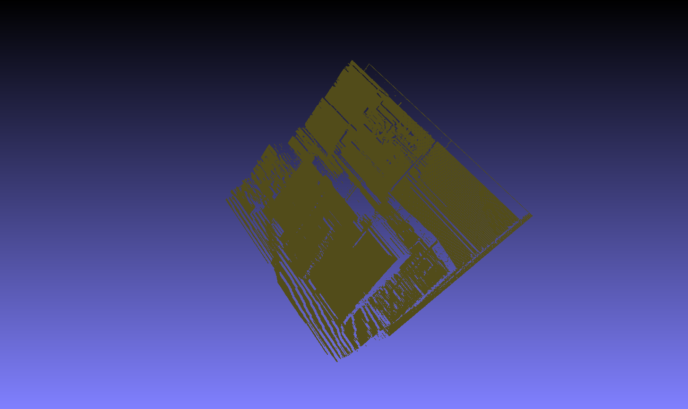
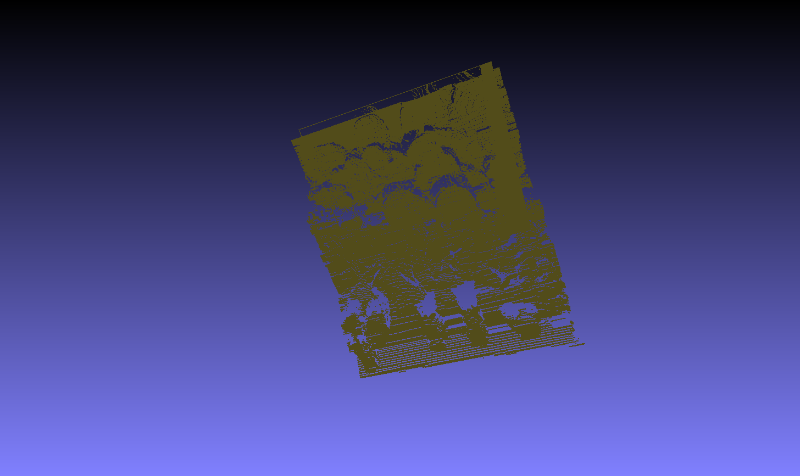 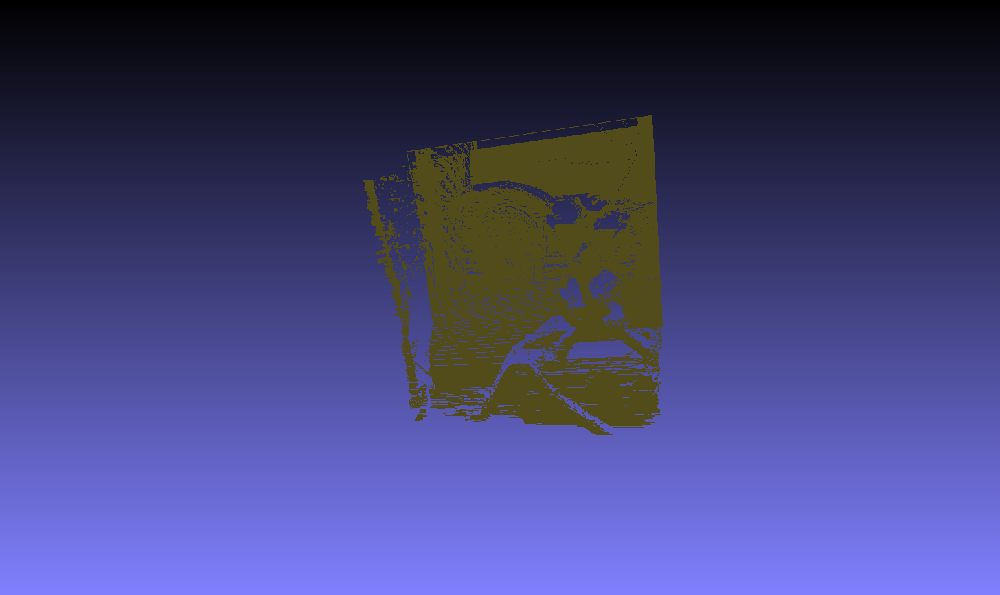

See more images and running times in [examples.ipynb](examples.ipynb)
See the algorithms in [stereo/stereo_estimation.py](stereo/stereo_estimation.py)
