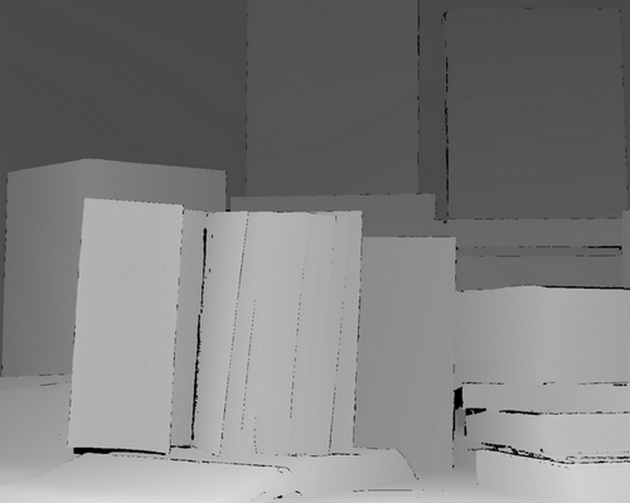

# Stereo Vision and Point Cloud Generation

This repository contains implementations and results of stereo vision algorithms designed to estimate depth from stereo image pairs and generate corresponding point clouds.

## Repository Structure

- `images/` - Contains the original left, right stereo images used for disparity estimation and the ground truth disparity maps against which algorithm accuracy is evaluated.
- `output/images` - Stores results from the disparity estimations and comparisons.
- `output/meshlab` - Contains results as images of 3D pointclouds rendered in Meshlab.
- `output/point_clouds/` - Features 3D point clouds as XYZ files generated from the disparity maps.

## Algorithms

Included in this repository are two primary algorithms for disparity estimation:

- **Naive Algorithm**: This simple implementation matches pixel blocks from the left and right images to estimate depth.
- **Dynamic Programming Algorithm**: An advanced approach that employs dynamic programming to enhance the accuracy and efficiency of disparity estimation.

### Original Images

 
 

### Ground Truth Disparity Maps

 
 

### Naive Approach Results

 
 

### Dynamic Programming Approach Results

 
 

### Point Cloud Visualizations

 
 

See more images and running times in [examples.ipynb](examples.ipynb)

See the algorithms in [stereo/stereo_estimation.py](stereo/stereo_estimation.py)
